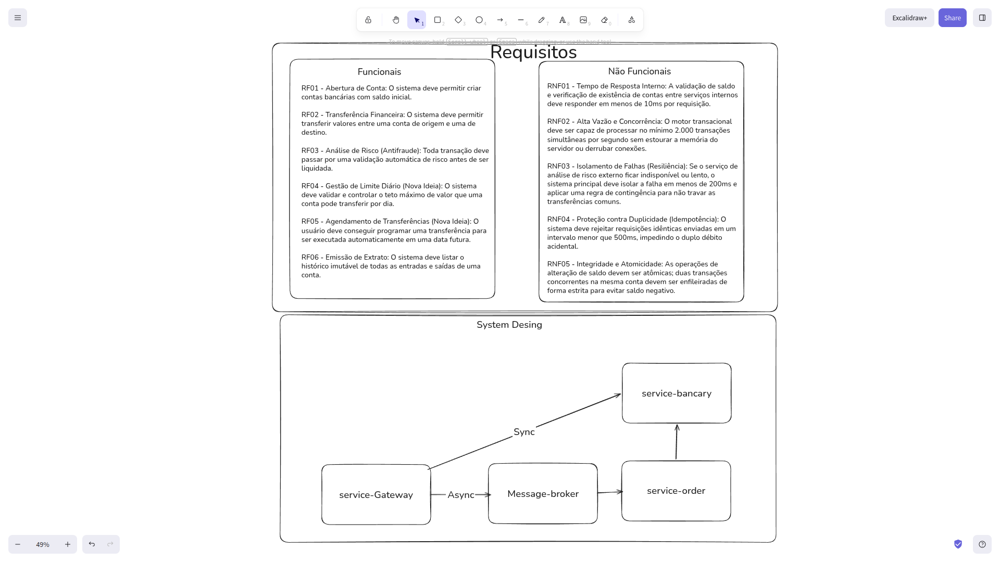

# 🏦 LedgerCore Engine - High-Throughput Core Banking

> ⚠️ **Status: Em Desenvolvimento Ativo**

Plataforma de microsserviços bancários focada em alta vazão, consistência estrita de dados (ACID) e concorrência massiva, utilizando o ecossistema moderno do Java 21.

---

## 🏗️ Arquitetura, Requisitos & Design

O fluxo macroscópico do ecossistema e as metas de engenharia (funcionais e não-funcionais) estão detalhados no diagrama abaixo, utilizado para guiar o ciclo de desenvolvimento:

---
